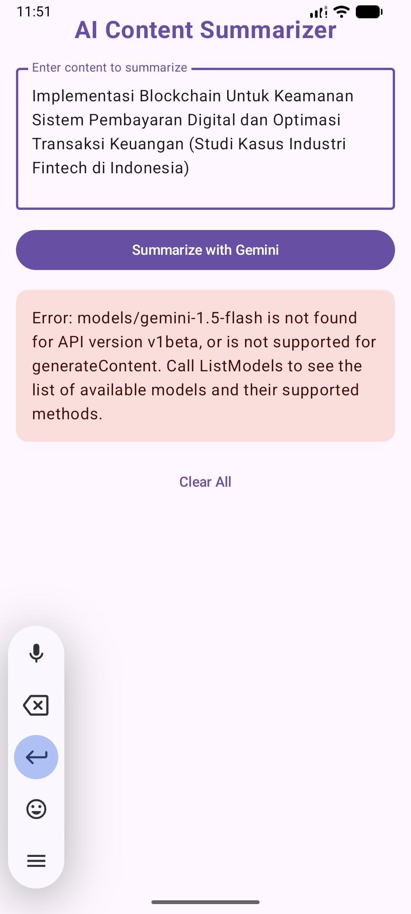

# AI Content Summarizer (GEMINI API KEY)

Proyek ini adalah aplikasi peringkas teks otomatis berbasis AI yang dibangun menggunakan **Kotlin Multiplatform (KMP)**. Aplikasi ini mengintegrasikan **Google Gemini API** untuk memproses teks panjang menjadi ringkasan yang padat dan informatif.

## 📸 Tampilan Aplikasi
Berikut adalah antarmuka pengguna dari AI Content Summarizer:

*(Ukuran gambar disesuaikan agar proporsional pada perangkat mobile)*

---

## 🛠️ Penjelasan Kode & Arsitektur

Aplikasi ini menggunakan arsitektur **MVVM (Model-View-ViewModel)** untuk memastikan kode terstruktur dan mudah dipelihara.

### 1. UI Layer (`App.kt`)
Bagian ini menangani tampilan aplikasi menggunakan **Compose Multiplatform**.
- **`SummarizationScreen`**: Komponen utama yang menampung TextField untuk input pengguna, tombol eksekusi, dan kartu hasil (Card) untuk menampilkan ringkasan.
- **State Handling**: Menggunakan `collectAsStateWithLifecycle()` untuk memantau perubahan status (Idle, Loading, Success, atau Error) secara real-time.

### 2. Logic Layer (`SummarizationViewModel.kt`)
Bertindak sebagai jembatan antara UI dan API.
- Mengelola **`SummarizationUiState`** untuk memberi tahu UI kapan harus menampilkan indikator loading atau pesan error.
- Menjalankan fungsi `summarizeText` di dalam `viewModelScope` agar aplikasi tetap responsif (tidak lag) saat melakukan request ke server.

### 3. Service Layer (`GeminiService.kt`)
Bagian yang menangani komunikasi jaringan.
- **Ktor Client**: Digunakan untuk melakukan HTTP POST request ke endpoint Google Gemini.
- **Model Configuration**: Menggunakan model `gemini-1.5-flash-latest` yang dioptimalkan untuk kecepatan.
- **System Instruction**: Memberikan perintah khusus kepada AI agar berperan sebagai "Highly efficient content summarizer" dan menghasilkan output dalam Bahasa Indonesia yang profesional.

### 4. Configuration (`AndroidManifest.xml`)
Mengatur izin perangkat agar aplikasi dapat berjalan dengan baik di platform Android.
- Menambahkan izin `android.permission.INTERNET` untuk memungkinkan aplikasi berkomunikasi dengan server Google Cloud.

---

## 🚀 Teknologi yang Digunakan
- **Kotlin Multiplatform (KMP)**: Berbagi logika bisnis di Android, iOS, dan Desktop.
- **Compose Multiplatform**: Framework UI deklaratif untuk semua platform.
- **Ktor**: Library networking yang ringan dan multiplatform.
- **Kotlinx Serialization**: Untuk konversi data JSON dari API secara otomatis.
- **Google Gemini API**: Otak kecerdasan buatan untuk pemrosesan bahasa alami.

---

## ⚙️ Cara Menjalankan
1. Pastikan Anda memiliki koneksi internet.
2. Pastikan file `GeminiService.kt` sudah berisi API Key yang valid.
3. Jalankan perintah berikut di terminal:
   - **Android**: `.\gradlew.bat :composeApp:installDebug`
   - **Desktop**: `.\gradlew.bat :composeApp:run`

---

© 2026 AI Summarizer Project - Tugas 9
